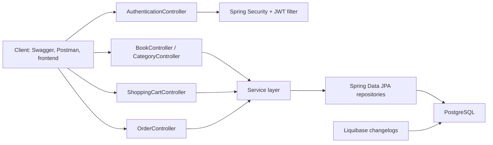

# Spring Boot Intro Book Store API

This project started as more than a CRUD exercise. The goal was to build a realistic backend for an online bookstore and practice the kinds of decisions that show up in production systems: secure authentication, role-based access, database migrations, containerized setup, and a clean flow from browsing books to placing an order.

The result is a layered Spring Boot application where guests can register and log in, users can work with a shopping cart and orders, and admins can manage the catalog. It is a compact project, but it touches the full journey of a modern REST API.

## Why this project matters

Many training projects stop at simple entity management. This one goes further and models an actual e-commerce flow:

- JWT-based authentication for stateless API access
- role-based authorization for `ADMIN` and `USER`
- catalog management for books and categories
- shopping cart operations
- order creation and order history
- reproducible database schema management with Liquibase
- API documentation with Swagger / OpenAPI
- automated verification with JUnit, Spring Security Test, Testcontainers, and GitHub Actions

## Video how project works

https://drive.google.com/file/d/14YWN0_QrvrnfgPtHoaMvDt6KyElowAPS/view?usp=sharing

## Tech stack

- Java 17
- Spring Boot 3.2.5
- Spring Web
- Spring Data JPA
- Spring Security
- JWT with `jjwt`
- Spring Validation
- Liquibase
- PostgreSQL
- Swagger / OpenAPI via `springdoc-openapi`
- MapStruct
- Lombok
- Docker and Docker Compose
- JUnit 5
- Testcontainers
- Maven Checkstyle Plugin
- GitHub Actions CI

## Architecture at a glance



## Main functionality

### AuthenticationController

- `POST /auth/registration` creates a new user account
- `POST /auth/login` authenticates a user and returns a JWT token

### BookController

- `GET /books` returns paginated books
- `GET /books/{id}` returns a single book by id
- `POST /books` creates a book for admins
- `PUT /books/{id}` updates a book for admins
- `DELETE /books/{id}` soft-deletes a book for admins

### CategoryController

- `POST /categories` creates a category for admins
- `GET /categories` returns paginated categories
- `GET /categories/{id}` returns category details
- `POST /categories/{id}` updates a category for admins
- `DELETE /categories/{id}` soft-deletes a category for admins
- `GET /categories/{id}/books` returns all books from a category

### ShoppingCartController

- `POST /cart` adds a book to the authenticated user's cart
- `GET /cart` returns the current shopping cart
- `POST /cart/{id}` updates cart item quantity
- `DELETE /cart/{id}` removes an item from the cart

### OrderController

- `POST /orders` creates an order from the current cart
- `GET /orders` returns paginated order history for the authenticated user
- `PATCH /orders/{orderId}` updates order status for admins
- `GET /orders/{id}/items` returns items in a specific order
- `GET /orders/{orderId}/items/{orderItemId}` returns one order item

## Access rules

- Public: `/auth/**`, `/swagger-ui/**`, `/v3/api-docs/**`
- `USER`: browse books and categories, manage cart, place orders, view personal order history
- `ADMIN`: create, update, and delete books and categories, update order statuses

## Database model

The project includes Liquibase migrations for:

- books
- categories
- many-to-many relation between books and categories
- users
- roles
- users and roles relation
- shopping carts and cart items
- orders and order items

Liquibase also seeds base roles so authorization is ready right after the first startup.

## Getting started

### Prerequisites

- Java 17
- Docker Desktop
- Maven wrapper included in the project

### 1. Create the environment file

Copy `.env.template` to `.env` and fill in the values. A working example:

```env
POSTGRES_USER=postgres
POSTGRES_PASSWORD=postgres
POSTGRES_DATABASE=book_store
POSTGRES_LOCAL_PORT=5432
POSTGRES_DOCKER_PORT=5432

SPRING_LOCAL_PORT=8080
SPRING_DOCKER_PORT=8080
SPRING_APPLICATION_NAME=book-store-api
DEBUG_PORT=5005

JWT_SECRET=supersecurejwtsecretkeysupersecure12
JWT_EXPIRATION=300000
```

`JWT_SECRET` must be long enough for HMAC signing. A 32+ character secret is the safest choice here.

### 2. Run locally with Spring Boot

This is the fastest option for development. Because the project includes `spring-boot-docker-compose`, Spring Boot can work with the `docker-compose.yml` file and connect to PostgreSQL while the app itself runs on your machine.

1. Make sure Docker Desktop is running.
2. Start the app:

```gitbash
docker compose up
```


3. Open Swagger UI:

```text
http://localhost:8088/swagger-ui/index.html
```

If your local setup does not pick up Docker Compose service connections automatically, provide the datasource variables manually:

```env
SPRING_DATASOURCE_URL=jdbc:postgresql://localhost:5432/book_store
SPRING_DATASOURCE_USERNAME=postgres
SPRING_DATASOURCE_PASSWORD=postgres
SPRING_JPA_PROPERTIES_HIBERNATE_DIALECT=org.hibernate.dialect.PostgreSQLDialect
```

### 3. Authenticate requests

1. Register a new account with `POST /auth/registration`.
2. Log in through `POST /auth/login`.
3. Copy the returned JWT token.
4. Send it in the `Authorization` header as `Bearer <token>` for protected endpoints.

## Example request flow

### Register

```json
{
  "email": "reader@example.com",
  "password": "password123",
  "repeatPassword": "password123",
  "firstName": "Jane",
  "lastName": "Reader",
  "shippingAddress": "221B Baker Street"
}
```

### Login

```json
{
  "email": "reader@example.com",
  "password": "password123"
}
```

### Call a protected endpoint

```bash
curl -X GET "http://localhost:8080/books?page=0&size=10" \
  -H "Authorization: Bearer <your-jwt-token>"
```

### Create category as admin

```json
{
  "name": "Fantasy",
  "description": "Magic, quests, and imaginative worlds"
}
```

### Create book as admin

```json
{
  "title": "The Hobbit",
  "author": "J.R.R. Tolkien",
  "isbn": "9780261103344",
  "price": 19.99,
  "description": "A classic adventure novel",
  "coverImage": "https://example.com/hobbit.jpg",
  "categoryIds": [1]
}
```

### Add item to cart

```json
{
  "bookId": 1,
  "quantity": 2
}
```

### Create order

```json
{
  "shippingAddress": "221B Baker Street"
}
```

## API documentation and Postman

Swagger UI is available at:

```text
http://localhost:8088/swagger-ui/index.html
```

The OpenAPI JSON is available at:

```text
http://localhost:8088/v3/api-docs
```

If you want to work in Postman, import the OpenAPI document from `/v3/api-docs`. That gives you a ready-made request collection without manually recreating every endpoint. For secured requests, add the JWT manually as an `Authorization: Bearer <token>` header.

## Testing and quality checks

Run tests:

```powershell
.\mvnw.cmd test
```

Run the full verification pipeline:

```powershell
.\mvnw.cmd verify
```

The project includes:

- controller tests
- service tests
- repository tests
- Testcontainers-based database testing
- Checkstyle validation
- GitHub Actions CI on push and pull request

## Challenges and lessons learned

Some of the most valuable parts of this project were not the endpoints themselves, but the engineering tradeoffs behind them:

- Designing stateless authentication with JWT instead of server sessions
- Separating responsibilities across controllers, services, repositories, and mappers
- Modeling relationships such as `books <-> categories`, `shopping cart -> cart items`, and `orders -> order items`
- Keeping schema evolution repeatable with Liquibase changelogs
- Making the project easier to run with Docker while still keeping a developer-friendly local workflow
- Testing security-sensitive and database-backed functionality with realistic integration tests

Working through those pieces helped turn the project from a simple academic exercise into something much closer to a real backend service.

## Possible next improvements

- add a prepared Postman collection to the repository
- add search and filtering for books
- add pagination examples to the README
- add global rate limiting or request throttling
- add deployment instructions for a cloud environment

## Author note

This project was built to strengthen practical backend skills with Spring Boot and to demonstrate clean architecture, security, testing, and documentation in one cohesive example. If you are reviewing it as part of a technical interview, the most important thing to notice is not only that the API works, but that the project was organized to be understandable, testable, and easy to run.
